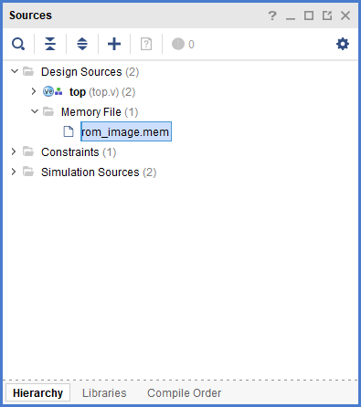
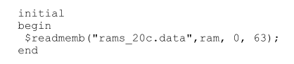

方法1：
将文件存为.mem格式，然后将它们添加到vivado项目中。
您可以像使用`"Add Sources"`然后选择 "Files of type: Memory Initialization Files".  
Vivado会自动将它们识别为内存文件.  
  
Initialize Memory in Verilog — Time to Explore
https://timetoexplore.net/blog/initialize-memory-in-verilog 

方法2：
用initial语句进行初始化  
ug627里的官方说明，为将仿真和综合区别开，请标明索引  
  