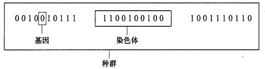

1. #### 遗传算法，Genetic Algorithm(GA)  

 ##### 介绍

  - 模拟达尔文进化论， 优胜劣汰，适者生存  

 ##### 原理
 
  模拟人工种群进化过程，选择(selection),交叉(crossover)以及变异(mutation)等机制，在每次迭代中都保留一组候选个体，重复此过程，种群经过若干代进化后，理想情况下其适应度到**近似最优**的状态  

##### 应用

    - 自从遗传算法被提出以来，其得到了广泛的应用，特别是在函数优化、生产调度、模式识别、神经网络、自适应控制等领域，遗传算法发挥了很大的作用，提高了一些问题求解的效率。

##### 算法组成

   |算法|遗传学|
   |---|---|
   |单个字符（bit)| 基因|
   |字符组成(数据，数组，位串) | 染色体(个体)
   |串位置|基因座|
   | 个体组成 | 种群(一代)
  

 
  - 运行参数
    - 是否选择
    

##### 基本原理

##### 运行流程  

  完整遗传算法： 编码， 初始种群生成， 适应度函数， 遗传算子， 终止准则  五个方面
  - 遗传算子
    - 选择
    - 交叉
    - 变异
  ps:  算子就是一种对于函数到函数的变换，加减乘除是基础的算子
  - 步骤：
    - 1.编码和产生初始种群
      根据问题，选择相应编码方法，并随机生成一个初始种群，种群由N个确定长度的染色体组成
    - 2.计算适应度值
      对种群的每个染色体计算它的适应度
    - 3.判断终止准则
      若符合终止条件，输出最优个体；否则重复执行4~6
    - 4.选择操作
      按个体适应度值所决定的某个规则选择将进入下一代的个体
    - 5.交叉操作
      以概率Pc交配，得到一个由N个染色体组成的新种群
    - 6.变异操作
      用小概率Pm使染色体基因发生变异，产生新鲜的种群
    - 运行条件
      a. 完成预定进化代数　　b.种群中最优个体在连续若干代没有改进   

###### 编码

     1. 完备性： 问题空间所有点(潜在解)都能成为编码空间的点
     2. 非冗余性 

     a. 二进制编码  
     b. 浮点数编码  
     c. 符号编码  